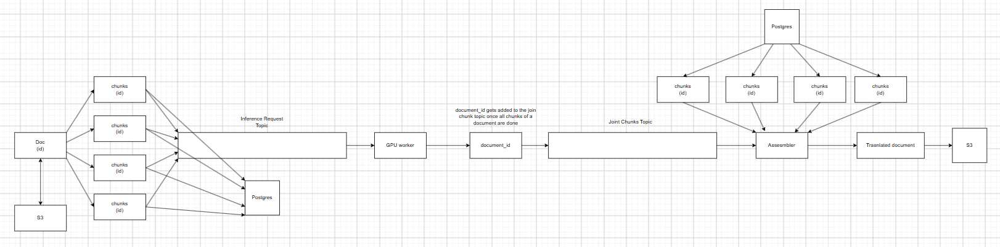

# DistServe

A distributed document-translation pipeline that takes a `.docx` file, fans it out into paragraph/table chunks, translates each chunk to Hindi via a self-hosted LLM, and reassembles the translated document — with atomic fan-in join detection, at-least-once Kafka delivery, and a Postgres source of truth for every chunk's state.

Built as a systems portfolio project: the point isn't the translation itself, it's the distributed-systems plumbing around running an inference engine in production — queueing, backpressure, atomic counters, failure handling, and a clean migration path across GPU providers.

---

## Architecture



```
      Client
        │  POST /translate (.docx)
        ▼
┌───────────────────┐
│  producer_service │  FastAPI. Auth + rate limiting middleware.
│  (main.py)        │  Extracts paragraphs/tables from the .docx into
└───────┬───────────┘  chunks, uploads the source file to S3/MinIO,
        │                writes chunk rows to Postgres, fans each
        │                chunk out onto Kafka.
        ▼
   Kafka: inference-request topic
        │
        ▼
┌───────────────────┐
│  consumer_service │  Reads inference-request, marks the job/chunk
│  (consumer.py)    │  RUNNING, and dispatches the chunk to the GPU
└───────┬───────────┘  worker (Modal, async spawn — fire and forget).
        │
        ▼
┌───────────────────┐
│  gpu_worker_modal │  vLLM AsyncLLMEngine (Qwen2.5-0.5B-Instruct)
│  (Modal, A10G)    │  running in-process inside a Modal @app.cls.
└───────┬───────────┘  Translates the chunk, writes the result back
        │                to Postgres, then runs a Redis Lua script
        │                that atomically decrements a per-document
        │                counter. Last chunk to land publishes to the
        │                Kafka join topic.
        ▼
Kafka: chunks-joined topic
        │
        ▼
┌────────────────────┐
│  assembler_service │  Pulls all chunks for the document from
│  (assembler_service│  Postgres, re-opens the original .docx from
│   .py)             │  S3, writes each translated chunk back into
└───────┬─────────── ┘  its original paragraph/table position, and
        │                uploads the finished document to S3.
        ▼
S3 / MinIO (translated/{document_id})
```

**Why this shape:**
- **Fan-out on Kafka, not a task queue** — chunk count per document is unbounded (a large `.docx` can be hundreds of paragraphs), and Kafka partitioning gives natural parallelism across consumers without a central scheduler.
- **Atomic fan-in via Redis Lua script** — many GPU worker instances finish chunks concurrently; a naive "read count, increment, compare" from Python is a race. The counter decrement and threshold check happen in one atomic Lua script server-side.
- **Postgres as source of truth, Redis as ephemeral coordination** — chunk status/results live in Postgres (durable, queryable, debuggable). Redis only tracks "how many chunks are left," and the key is deleted once the join fires — it's disposable state, not a database.
- **`address` as a single JSONB column** — each chunk stores its position (`{"type": "paragraph", "paragraph_index": i}` or `{"type": "table", "table_index": t, "cell_ids": [...]}`) in one JSONB field rather than a wide table of nullable positional columns. The assembler reads `address` back out to know exactly where to write the translated text.
- **Same S3 bucket, different key prefixes** for source vs. translated documents (`{document_id}` vs `translated/{document_id}`) — avoids provisioning/IAM overhead of a second bucket for a two-prefix use case.

---

## Tech stack

| Layer | Tech |
|---|---|
| API | FastAPI, uvicorn |
| Messaging | Kafka (aiokafka), Zookeeper |
| Coordination | Redis (async client, Lua scripts for atomic counters + rate limiting) |
| Storage | Postgres (asyncpg) + PgBouncer, S3-compatible object storage (MinIO locally) |
| Inference | vLLM `AsyncLLMEngine`, Qwen2.5-0.5B-Instruct, served from [Modal](https://modal.com) (A10G, scale-to-zero) |
| Document parsing | `python-docx` |
| Shared code | `distserver-common` — an internal pip package (`discom`) with shared Pydantic settings, SQL queries, and constants used by every service |

The GPU worker was originally deployed on RunPod Serverless; that code is still in the repo under `gpu_worker/` (RunPod handler) alongside the current `gpu_worker_modal/` path, kept intentionally as a record of the migration — RunPod's fleet had unresolvable CUDA/driver mismatches across hosts, which is what motivated the move to Modal.

---

## Running it locally

**Infra:**

```bash
cp .env.example .env   # fill in Postgres/Redis/MinIO/Kafka/HF token values
docker compose up -d
```

This brings up Postgres (+ PgBouncer), Redis, Kafka (+ Zookeeper + Kafka UI on `:8080`), and MinIO (console on `:9001`). The `kafka-setup` container creates the `inference-request` topic on boot.

**Services** (each has its own `Dockerfile` and `requirements.txt`):

```bash
# from repo root, one terminal each
cd producer_service    && uvicorn main:app --reload
cd consumer_service    && python consumer.py
cd assembler_service   && python assembler_service.py
```

**GPU worker (Modal):**

```bash
cd gpu_worker_modal
modal secret create distserve-env --from-dotenv ../.env
modal deploy generator.py
```

`consumer_service` calls the deployed worker by name (`modal.Cls.from_name("distserve-gpu-worker", "GPUWorker")`), so it needs to be deployed (not just `modal run`) before the pipeline works end to end.

**Try it:**

```bash
curl -X POST http://localhost:8000/translate \
  -H "X-API-Key: <your-api-key>" \
  -F "file=@/path/to/document.docx"
```

Register a user first via `POST /register_user` to get an API key.

---

## Known limitations

- `gpu_worker/` (RunPod) is dead code, kept for the migration story rather than deleted.

---

## Repo layout

```
producer_service/      FastAPI ingest API — upload, auth, rate limiting, chunk extraction
consumer_service/       Kafka consumer — dispatches chunks to the GPU worker
gpu_worker_modal/       vLLM inference on Modal (current)
gpu_worker/              vLLM inference on RunPod (archived — superseded by gpu_worker_modal)
assembler_service/      Kafka consumer — reassembles the translated .docx and uploads to S3
distserver-common/      Shared `discom` package: Pydantic settings, SQL queries, constants, logger
sp/                      Postgres schema (create_table.sql)
docker-compose.yml       Local infra: Postgres, PgBouncer, Redis, Kafka, MinIO
```